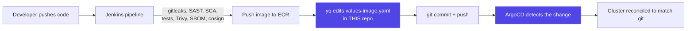
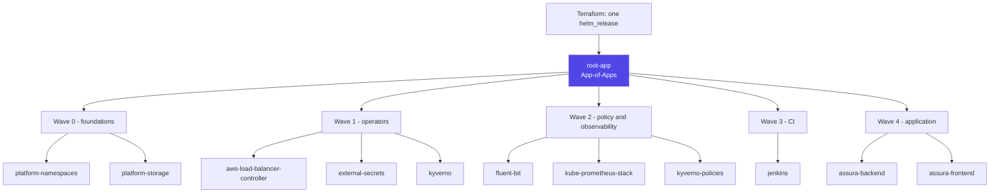

# assura-gitops

GitOps source of truth for **Assura**, a Fixed Asset Management System deployed on Amazon EKS.
This repo is the only thing ArgoCD trusts: every workload, policy, and platform component running
in the cluster is declared here and reconciled continuously. Nothing is ever deployed by running
`kubectl apply` by hand.

> **Part of a four-repo system.** The application code lives in
> [`AssuraBackend`](https://github.com/System-Street-Studio/AssuraBackend) (.NET 8 / Clean
> Architecture) and [`assura-frontend`](https://github.com/System-Street-Studio/assura-frontend)
> (Angular 21). Cloud infrastructure is provisioned by
> [`assura-infra`](https://github.com/System-Street-Studio/assura-infra) (Terraform). This repo is
> the bridge between them: CI (Jenkins) builds images and edits one line here; ArgoCD does the rest.

## How a deploy actually happens



Jenkins never runs `kubectl`, never has cluster credentials, and never touches any file outside
`charts/*/values-image.yaml`. ArgoCD is the only actor with write access to the cluster. This is
the entire point of the pattern: a compromised or buggy pipeline can push a bad image tag, but it
cannot touch RBAC, network policy, secrets wiring, or anything else declared here.

## Bootstrap: how this repo enters the cluster

Terraform (`assura-infra`) applies exactly **one** resource directly — the ArgoCD Helm release —
then applies exactly **one** manifest: [`bootstrap/root-app.yaml`](bootstrap/root-app.yaml). That
single `Application` is an **App-of-Apps**: it points at `apps/` and turns every file in that
directory into its own child `Application`, ordered by `argocd.argoproj.io/sync-wave` so
dependencies come up in the right order.



Everything after that first Terraform apply is self-managed: every `Application` here runs with
`syncPolicy.automated: { prune: true, selfHeal: true }`, so drift is corrected automatically and
deleting something out-of-band gets it recreated on the next reconcile.

## Applications at a glance

| Wave | Application | What it is |
|---|---|---|
| 0 | `platform-namespaces` | Namespaces, pre-labelled for Pod Security Standards `restricted` |
| 0 | `platform-storage` | Default `gp3` StorageClass (EKS ships none by default) |
| 1 | `aws-load-balancer-controller` | Provisions the shared ALB from `Ingress` resources |
| 1 | `external-secrets` | Syncs AWS Secrets Manager entries into native `Secret` objects |
| 1 | `kyverno` | Policy engine — admission control for everything below |
| 2 | `fluent-bit` | Ships container logs to CloudWatch Logs |
| 2 | `kube-prometheus-stack` | Prometheus + Grafana + Alertmanager |
| 2 | `kyverno-policies` | This project's 6 `ClusterPolicy` rules (see below) |
| 3 | `jenkins` | CI controller, configured entirely via JCasC |
| 4 | `assura-backend` | The .NET API — chart in `charts/assura-backend/` |
| 4 | `assura-frontend` | The Angular SPA — chart in `charts/assura-frontend/` |

Both application Ingresses share one ALB (`alb.ingress.kubernetes.io/group.name`), so the whole
system — API and UI — is served behind a single load balancer.

## Repository layout

```
bootstrap/root-app.yaml    The one manifest Terraform applies directly (App-of-Apps root)
apps/*.yaml                One ArgoCD Application per row in the table above
manifests/namespaces/      Plain Namespace objects, wave 0
manifests/storage/         Default StorageClass, wave 0
charts/assura-backend/     This project's Helm chart for the API
charts/assura-frontend/    This project's Helm chart for the SPA
charts/kyverno-policies/   The ClusterPolicy set below, packaged as a chart
```

`values-image.yaml` inside each app chart is the **only** file CI ever edits — a single `image.tag`
key, updated via `yq` at the end of each Jenkins pipeline. Isolating CI's write access to one line
in one file is deliberate: it bounds the blast radius of anything going wrong in the pipeline to
"wrong image tag," never chart logic, RBAC, or network policy.

## Security posture

Enforced today, on every resource ArgoCD applies:

- **No static AWS credentials anywhere.** Every workload (backend pods, Jenkins agents,
  External Secrets, the LB controller) authenticates via **IRSA** — a scoped IAM role bound to a
  Kubernetes ServiceAccount. Secrets Manager access is granted to the identity that needs to *read*
  a secret; application workloads never hold Secrets Manager permissions themselves — they receive
  credentials as environment variables materialized by External Secrets.
- **Pod Security Standards `restricted`** on the application namespace: non-root, no privilege
  escalation, all capabilities dropped, read-only root filesystem, seccomp required.
- **Kyverno enforces 6 `ClusterPolicy` rules** (`charts/kyverno-policies/`) on top of that baseline,
  as defense in depth against the same class of misconfiguration:

  | Policy | Rejects |
  |---|---|
  | `require-non-root` | Containers without `runAsNonRoot: true` |
  | `disallow-privilege-escalation` | Containers without `allowPrivilegeEscalation: false` |
  | `require-ro-rootfs` | Containers without a read-only root filesystem |
  | `disallow-latest-tag` | Any image without an explicit, immutable tag |
  | `restrict-image-registries` | Any image not pulled from this project's own ECR repositories |
  | `require-resource-limits` | Any container missing CPU/memory requests and limits |

- **Default-deny NetworkPolicies**, with explicit allows only for the traffic each workload
  actually needs (frontend→backend, backend→RDS, both→DNS/AWS APIs).
- **Immutable image tags** in ECR (`IMAGE_TAG_MUTABILITY=IMMUTABLE`), paired with
  `disallow-latest-tag` above — every deploy traces to one exact, unambiguous build.

Supply-chain stages wired into both Jenkinsfiles (secret scanning, SAST, dependency scanning,
Trivy image scanning, SBOM generation, cosign image signing via KMS) — see each application repo's
`Jenkinsfile` for the authoritative stage list.

## Deploying this to a different AWS account

Every account-specific value in this repo (IAM role ARNs, ECR registry URLs, Secrets Manager ARNs,
the AWS account ID) is a plain literal, not a templated placeholder — this is the actual, working
configuration for one specific deployment. To fork this into a different account, replace every
occurrence of the account ID and the ARNs under `serviceAccount.roleArn` /
`secretsManager.*SecretArn` in both charts' `values.yaml`, and in `apps/01-external-secrets.yaml`,
`apps/01-aws-load-balancer-controller.yaml`, `apps/02-fluent-bit.yaml`, and `apps/03-jenkins.yaml`,
with the equivalent outputs from a fresh `assura-infra` apply. `assura-infra`'s own README documents
exactly which Terraform output maps to which field here.

`ingress.host` in both application charts' `values.yaml` is intentionally empty — the shared
Ingress matches any `Host` header, so the ALB's own DNS name is directly browsable with no domain
required. Set it once a real domain is pointed at the ALB.

## Why this repo is public

No real secrets live here by design — only account identifiers and role ARNs, which are not
sensitive on their own (they grant nothing without the AWS account's trust policy). That lets
ArgoCD sync with a plain anonymous HTTPS clone, no repository credential required, and lets anyone
— including an interviewer — read the actual GitOps structure without being granted access.

Jenkins still needs a **write** credential regardless of visibility, since GitHub never allows an
anonymous `git push` — provisioned via Secrets Manager and IRSA, never a static token in Jenkins
config. See `assura-infra/README.md` for how that credential is wired.

## PR validation

[`.github/workflows/validate.yml`](.github/workflows/validate.yml) lints every PR on plain GitHub
Actions rather than Jenkins-in-cluster — rendering and validating Helm/YAML needs no cluster
compute, so PRs here stay checkable even while the demo cluster is fully torn down between uses.

## Operating cost

This is a real, cost-conscious deployment, not a permanently-on demo: EKS + Spot nodes + RDS +
ALB run to roughly $200–260/month while live. The cluster is brought up before a demo and torn down
afterward (`terraform apply` / `terraform destroy` in `assura-infra/environments/demo`) rather than
run continuously. What survives a teardown: an RDS final snapshot, this repo, and the Terraform
state backend (`assura-infra/environments/global`). Pushed ECR images currently do **not** survive
— the ECR module lives in the `demo` environment rather than `global`, so a fresh `apply` after a
teardown needs at least one pipeline run before there's an image to deploy. Moving `module.ecr` to
`global` would fix this; noted here as a known gap rather than silently left undocumented.
